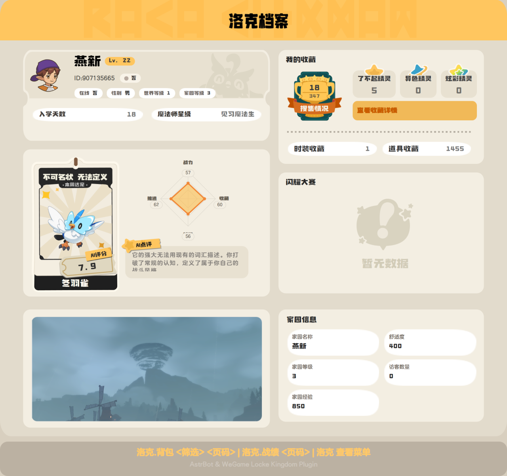
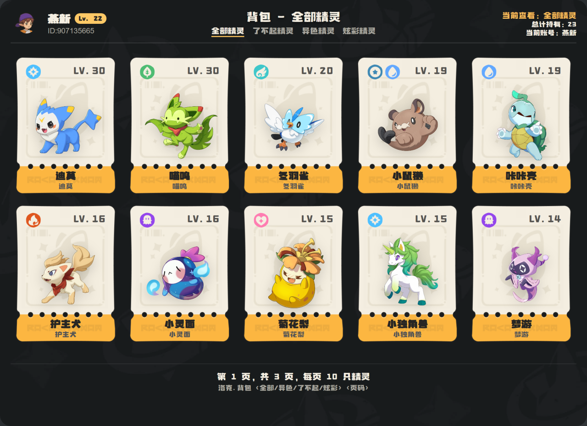
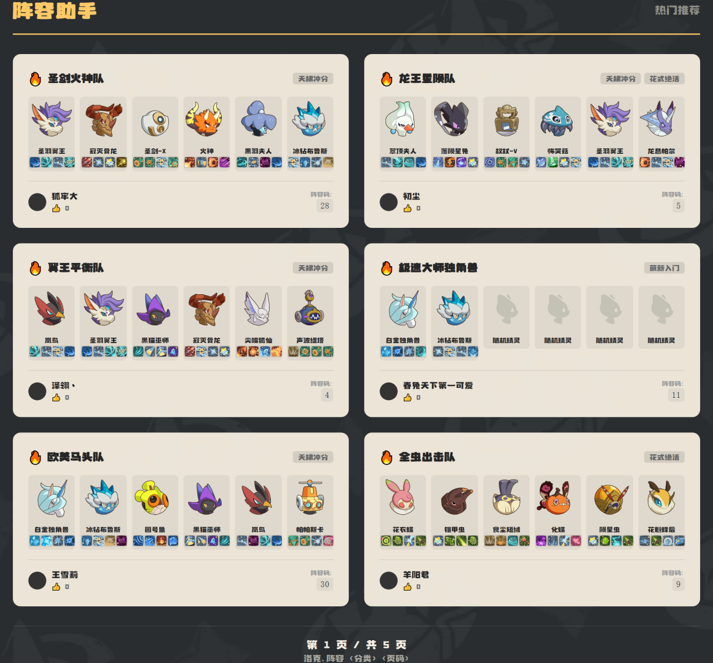
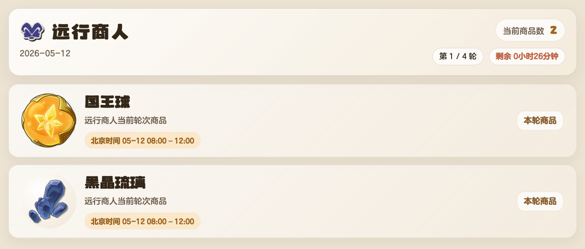
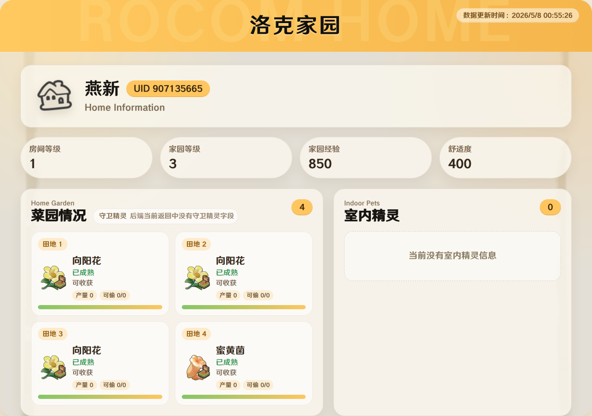

# koishi-plugin-rocom


注意，本项目仍处于开发调试期，可能会有未知BUG的产生。  
> APIKey  
> sk-ba042e079cf9ccb30e72b3d5af458f45  
> sk-c7952558b84a176b76d0215760732330  
> sk-b3d96323b2b045282c52f81ca43fcad8  
> sk-5c14c1e5da063037d02c15e50285dd04  
> 交流反馈：1097809141  
[](https://www.npmjs.com/package/koishi-plugin-rocom)

Koishi 版洛克王国数据查询插件。插件基于 WeGame / 后端接口提供账号绑定、个人档案、战绩、背包、阵容、交换大厅、远行商人、查蛋配种、Wiki 查询等功能。


### 安全免责声明

- 绑定后的 `token`、`ticket`、扫码凭证等均属于敏感信息，请务必自行妥善保存。
- 请勿截图公开、发送他人，或提交到公开仓库，避免凭证泄露后被冒用。
- 因凭证或绑定信息泄露导致的账号风险、查询被冒用或相关损失，需要由使用者自行承担。
- 非必要不要频繁手动刷新凭证，服务端会自动刷新。
## 使用前准备

本插件依赖 Koishi 的 `database` 服务和 `koishi-plugin-puppeteer` 服务。请先在 Koishi 控制台启用：

- `database`
- `puppeteer`
- `rocom`

如果图片渲染失败，插件会尽量回落为文字结果；但档案、战绩、背包、阵容、交换大厅、远行商人和查蛋配种等功能推荐配合 Puppeteer 使用。

| 功能 | 示例图片 |
| --- | --- |
| 帮助菜单 |  |
| 个人档案 |  |
| 背包 |  |
| 阵容推荐 |  |
| 阵容详情 |  |
| 远行商人 |  |
| 家园 |  |
| 查蛋 |  |

## 配置项

| 配置项 | 默认值 | 说明 |
| --- | --- | --- |
| `apiBaseUrl` | `https://wegame.shallow.ink` | 后端 API 基础地址 |
| `wegameApiKey` | 空 | WeGame API Key，如后端要求鉴权则填写 |
| `qqLoginDebugMode` | `false` | QQ 扫码登录调试模式，可能输出敏感凭证，仅调试时开启 |
| `adminUserIds` | `[]` | Bot 管理员用户 ID 列表，用于管理员命令 |
| `autoRefreshEnabled` | `false` | 是否启用自动刷新凭证 |
| `autoRefreshTime` | `["00:00", "12:00"]` | 自动刷新凭证的时间点 |
| `merchantSubscriptionEnabled` | `true` | 是否启用远行商人订阅检查 |
| `merchantSubscriptionItems` | `["国王球", "棱镜球", "炫彩精灵蛋"]` | 默认关注的远行商人商品 |
| `merchantCheckInterval` | `300000` | 远行商人订阅检查间隔，单位毫秒 |
| `merchantPrivateSubscriptionEnabled` | `true` | 是否允许私聊订阅远行商人推送 |
| `homeSubscriptionEnabled` | `true` | 是否启用家园菜园和灵感订阅推送 |
| `homeSubscriptionIntervalMinutes` | `5` | 家园订阅检查间隔，单位分钟 |
| `imageCompressionEnabled` | `true` | 是否在发送图片前启用 PNG 无损压缩 |
| `imageCompressionMinBytes` | `262144` | 触发压缩的最小图片大小，单位字节 |
| `imageCompressionLevel` | `9` | PNG zlib 压缩等级，范围 `0-9`，数值越大通常越小但更耗时 |

### 图片压缩设置

后台配置页中有单独的“图片压缩设置”分组。该功能会在图片发送前对 PNG 的 IDAT 数据做无损重压缩，不会改变图片尺寸、画质或透明度。若压缩失败，或压缩后文件没有变小，会自动发送原图。


## 快速开始

1. 启用 `database`、`puppeteer` 和本插件。
2. 使用 `洛克.QQ登录` 或 `洛克.微信登录` 绑定账号。
3. 发送 `洛克.档案` 测试账号数据是否可正常查询。
4. 发送 `洛克` 查看内置帮助菜单。

```text
洛克.QQ登录
洛克.档案
洛克.背包
洛克.查蛋 喵喵
```


## 指令说明

完整的指令列表、参数与示例请到指令文档查看：

- [指令说明文档](docs/commands.md)

## 常见问题

### 提示“您尚未绑定洛克王国账号”

请先使用 `洛克.QQ登录` 或 `洛克.微信登录` 绑定账号，再使用档案、战绩、背包、阵容、交换大厅等账号相关功能。


### 图片生成失败

请检查：

- 是否启用了 `koishi-plugin-puppeteer`。
- Puppeteer 是否能正常启动浏览器。
- 服务器是否能访问模板中引用的远程图片。
- 平台是否允许发送图片消息。

插件在图片失败时会尽量发送文字回退结果。


### QQ 扫码登录超时

二维码有效期约 2 分钟。超时后请重新发送 `洛克.QQ登录`。


### 远行商人订阅没有推送

请检查：

- `merchantSubscriptionEnabled` 是否开启。
- 会话是否已经使用 `订阅远行商人` 设置订阅，可用 `查看远行商人订阅` 确认当前订阅内容。
- 按关键词订阅时，商品名称是否能命中当前远行商人商品（按包含关系匹配）。
- 全部订阅模式（`订阅远行商人 全部`）在本轮商品为空时不会推送；每轮 `08:00 / 12:00 / 16:00 / 20:00` 只推一次，已推过的轮次不会重复。
- Bot 是否有向目标群聊发送消息的权限。


## 许可证

本项目使用 MIT License。
